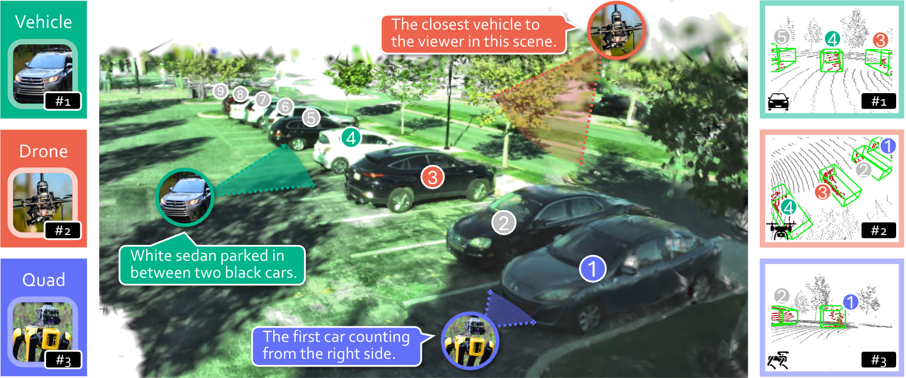

<h1 align="center">3EED: Ground Everything Everywhere in 3D</h1>

<p align="center">
  <strong>Rong Li</strong><sup>1</sup>,
  <strong>Yuhao Dong</strong><sup>2</sup>,
  <strong>Tianshuai Hu</strong><sup>3</sup>,
  <strong>Ao Liang</strong><sup>4</sup>,
  <strong>Youquan Liu</strong><sup>5</sup>,
  <strong>Dongyue Lu</strong><sup>4</sup>
</p>
<p align="center">
  <strong>Liang Pan</strong><sup>6</sup>,
  <strong>Lingdong Kong</strong><sup>4†</sup>,
  <strong>Junwei Liang</strong><sup>1,3‡</sup>,
  <strong>Ziwei Liu</strong><sup>2‡</sup>
</p>

<p align="center">
  <sup>1</sup>HKUST(GZ), 
  <sup>2</sup>NTU, 
  <sup>3</sup>HKUST, 
  <sup>4</sup>NUS, 
  <sup>5</sup>FDU, 
  <sup>6</sup>Shanghai AI Laboratory
</p>

<p align="center">
  <sup>*</sup>Equal Contributions &nbsp;
  <sup>†</sup>Project Lead &nbsp; 
  <sup>‡</sup>Corresponding Authors
</p>


<!-- # Introduction -->


<p align="center">
  
</p>


# 📚 Table of Contents

- [📚 Table of Contents](#-table-of-contents)
- [🔧 Environment Setup](#-environment-setup)
  - [⚙️ Compilation](#️-compilation)
- [📦 Pretrained Language Model](#-pretrained-language-model)
- [🛠 Path Configuration](#-path-configuration)
- [📁 Dataset Preparation](#-dataset-preparation)
- [🚀 Single-Object 3D Visual Grounding](#-single-object-3d-visual-grounding)
  - [Training on All Platforms (Union)](#training-on-all-platforms-union)
  - [Training on a Single Platform (e.g., Quadruped)](#training-on-a-single-platform-eg-quadruped)
  - [Evaluation on All Platforms](#evaluation-on-all-platforms)
  - [Evaluation on a Single Platform](#evaluation-on-a-single-platform)
- [🎯 Multi-Object 3D Visual Grounding](#-multi-object-3d-visual-grounding)
  - [Training](#training)
  - [Evaluation](#evaluation)
<!-- - [Contact](#-contact) -->


# 🔧 Environment Setup

**System**
- OS: Ubuntu 22.04 (Linux 5.15.0-57-generic)
- Python: 3.9.18
- GCC: 9.5.0

**Hardware**
- GPU: NVIDIA GeForce RTX 3090
- Driver Version: 570.86.15

**CUDA Runtime**
- CUDA Toolkit: 11.1  
- cuDNN: 8.0.5

**Python Libraries**
- PyTorch: 1.9.1+cu111  
- Other dependencies: see [`environment.yaml`](./environment.yaml)

To reproduce the environment:
```bash
conda env create -f environment.yaml
conda activate SG_Nav
```

## ⚙️ Compilation

Compile custom CUDA ops before training:

```
cd ops/teed_pointnet/pointnet2_batch
python setup.py develop
```

then,
```
cd ops/teed_pointnet/roiaware_pool3d
python setup.py develop
```

# 📦 Pretrained Language Model

Download the `roberta_base` checkpoint and place it under:
```
data/roberta_base/
```

# 🛠 Path Configuration

Set your project root path manually if necessary:

Example:
```
sys.path.append("/home/your_username/code/3eed/")
```


# 📁 Dataset Preparation

After downloading the dataset, extract and place it in:
```
cd data/3eed
```

The expected folder structure:
```
├── M3ED-Drone 
    ├── ...
    └── Outdoor_Day_penno_trees
├── M3ED-Quadruped 
    ├── ...
    └── Outdoor_Day_srt_under_bridge_2
├── roberta_base 
├── splits
└── waymo
```

# 🚀 Single-Object 3D Visual Grounding

## Training on All Platforms (Union)

```
bash scripts/train_3eed.sh
```

## Training on a Single Platform (e.g., Quadruped)

```
bash scripts/train_quad.sh
```

## Evaluation on All Platforms

```
bash scripts/val_3eed.sh
```
Make sure to set the correct path for `--checkpoint_path` in the script.

## Evaluation on a Single Platform

```
bash scripts/val_quad.sh
```


# 🎯 Multi-Object 3D Visual Grounding

## Training

```
scripts/train_multi_3eed.sh
```

## Evaluation

```
scripts/val_multi_3eed.sh
```
Make sure to set the correct path for `--checkpoint_path` in the script.
